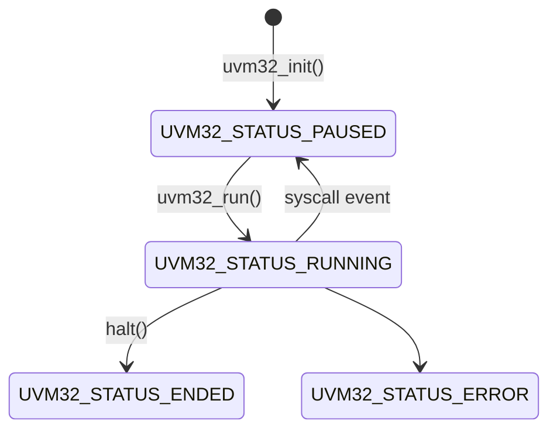

## Quickstart (docker)

    make dockerbuild
    make dockershell

Then, from inside the docker shell

    make

    ./hosts/host/host apps/helloworld/helloworld.bin

`host` is the command line test VM for running samples. Run `host -h` for a full list of options.

## Native build

The example VM hosts should all build with any C compiler. To build all of the examples in `apps`, you will need a RISC-V cross compiler, Zig 0.15.2 and Rust (stable). To build the example `host-arduino` you will need `arduino-cli`.

On mac

    brew install arduino-cli riscv64-elf-gcc riscv64-elf-binutils sdl3

    cd hosts/host-sdl
    make
    cd apps/zigdoom
    make test


## Quickstart API

```c
uint8_t bytecode[] = { /* ... */ }; // some compiled bytecode
uvm32_state_t vmst; // execution state of the vm
uvm32_evt_t evt; // events passed from vm to host

uvm32_init(&vmst); // setup vm
uvm32_load(&vmst, bytecode, sizeof(bytecode)); // load the bytecode
uvm32_run(&vmst, &evt, 100); // run up to 100 instructions

switch(evt.typ) {
	// check why the vm stopped executing
}
```

## Operation

Once loaded with bytecode, uvm32's state is advanced by calling `uvm32_run()`.

	uint32_t uvm32_run(uvm32_state_t *vmst, uvm32_evt_t *evt, uint32_t instr_meter)
	
`uvm32_run()` will execute until the bytecode requests some IO activity from the host.
These IO activities are called "syscalls" and are the only way for bytecode to communicate with the host.
If the bytecode attempts to execute more instructions than the the passed value of `instr_meter` it is assumed to have crashed and an error is reported.

(As with a watchdog on an embedded system, the `yield()` bytecode function tells the host that the code requires more time to complete and has not hung)

`uvm32_run()` always returns an event. There are four possible events:

* `UVM32_EVT_END` the program has ended
* `UVM32_EVT_ERR` the program has encountered an error
* `UVM32_EVT_SYSCALL` the program requests some IO via the host

## Internals

uvm32 emulates a RISC-V 32bit CPU using [mini-rv32ima](https://github.com/cnlohr/mini-rv32ima). All IO from vm bytecode to the host is performed using `ecall` syscalls. Each syscall provided by the host requires a unique syscall value. A syscall passes two values and receives one on return.

uvm32 is always in one of 4 states, paused, running, ended or error.



## Boot

At boot, the whole memory is zeroed. The user program is placed at the start. The stack pointer is set to the end of memory and grows downwards. No heap region is setup and all code is in RAM.

## ExtRAM

A single block of external RAM may be memory mapped into the VM at any time using:

    uvm32_extram(uvm32_state_t *vmst, uint32_t *ram, uint32_t len)

The `ram` region must be 32bit aligned, as all accesses will be 32bit words. The `len` is given in bytes.

From inside the VM, the memory is available from address `0x10000000`

    uint32_t *p = (uint32_t *)UVM32_EXTRAM_BASE;
    p[0] = 0xDEADBEEF;

When the external RAM is written to by the VM, the dirty flag will be set. The flag is automatically cleared on the next call to `uvm32_run()`. The flag can be checked using:

    bool uvm32_extramDirty(uvm32_state_t *vmst)


## Event driven operation

A useful pattern for code running in the VM is to be event-driven. In this setup the program requests blocks until woken up with a reason. This requires some support in the host, but can be implemented as follows.

In the VM code:

```c
while(1) {
    // ask host to suspend running until one of the following events
    uint32_t wakeReason = yield(KEYPRESS_EVENT_MASK | MOUSE_EVENT_MASK | NETWORK_EVENT_MASK);
    switch(wakeReason) {
        ...
    }
}
```

In the host code:

```c
uvm32_run(&vmst, &evt, 1000);
switch(evt.typ) {
    case UVM32_EVT_SYSCALL:
        switch(evt.data.syscall.code) {
            case UVM32_SYSCALL_YIELD:
                uint32_t events = uvm32_getval(&vmst, &evt, ARG0);
                // do not call uvm32_run() again until something in the events set is triggered
            break;
            ...
        }
    break;
    ...
}
```

Then, to wake the VM once an (eg. key) event has occurred

```c
uvm32_setval(&vmst, &evt, RET, KEYPRESS_EVENT_MASK);
uvm32_run(&vmst, &evt, 1000);
```

## Configuration

The uvm32 memory size is set at compile time with `-DUVM32_MEMORY_SIZE=X` (in bytes). A memory of 512 bytes will be sufficient for trivial programs.

Define `UVM32_ERROR_STRINGS` to add an `errstr` field to `uvm32_evt_err_t` giving a printable error string.

Define `UVM32_STACK_PROTECTION` to enable a basic stack canary, to cause an early crash when the stack grows too large. Without this, the VM will normally crash (safely) in some other way which is less easily detected.

## Debugging

Binaries can be disassembled with

    riscv64-elf-objdump -d -f hello-asm.elf
    riscv64-elf-objdump -S -d -b binary -m riscv:rv32 -D -M no-aliases -f hello-asm.bin

